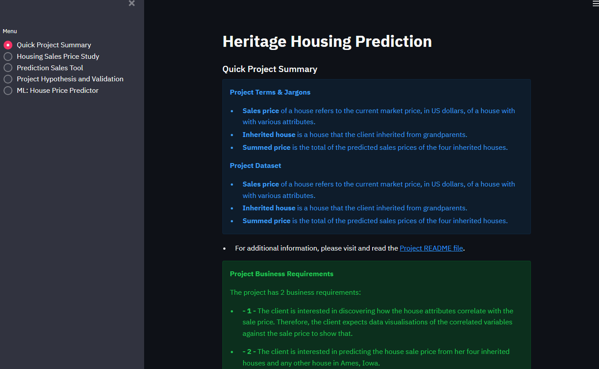
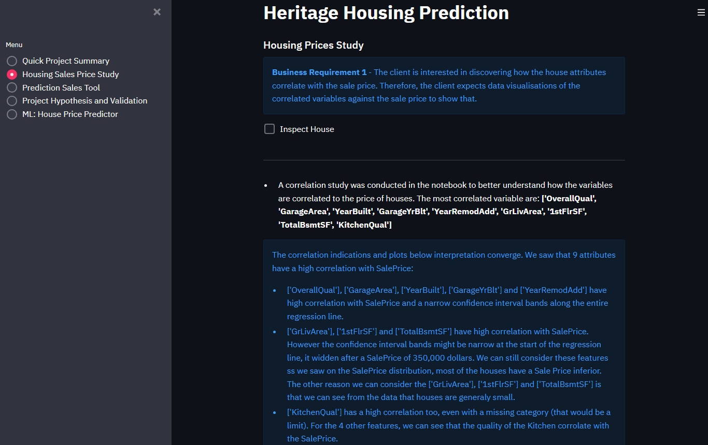
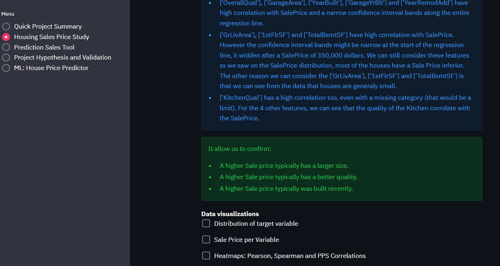
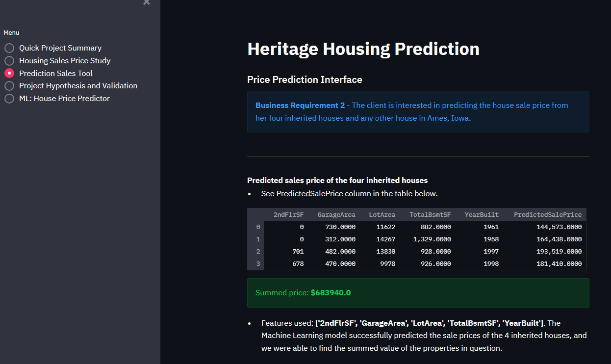
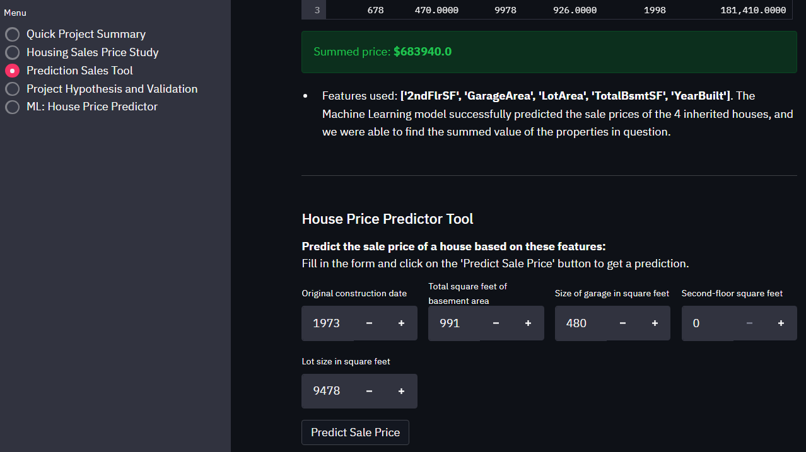
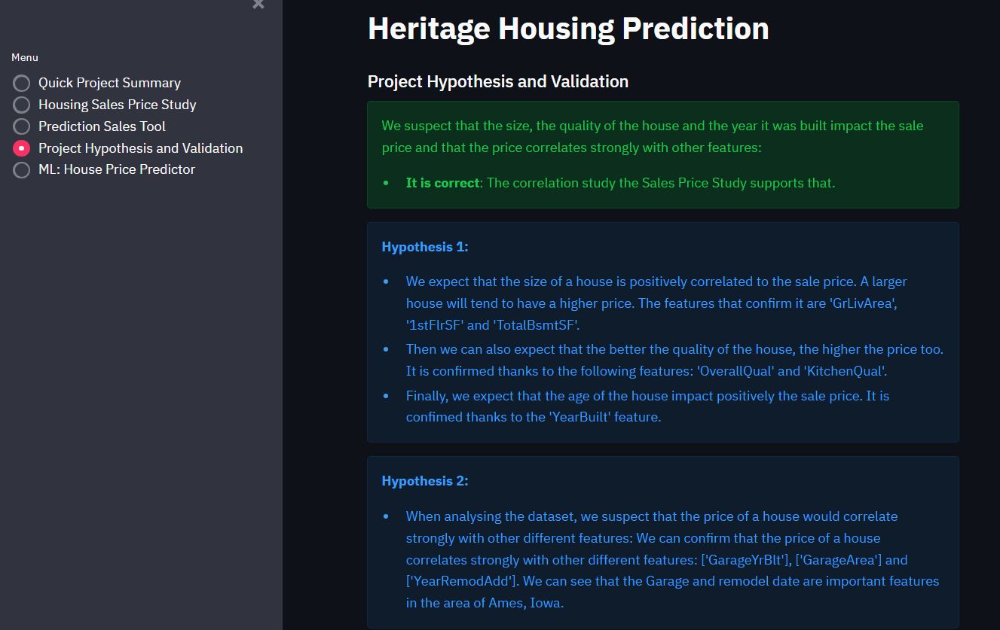
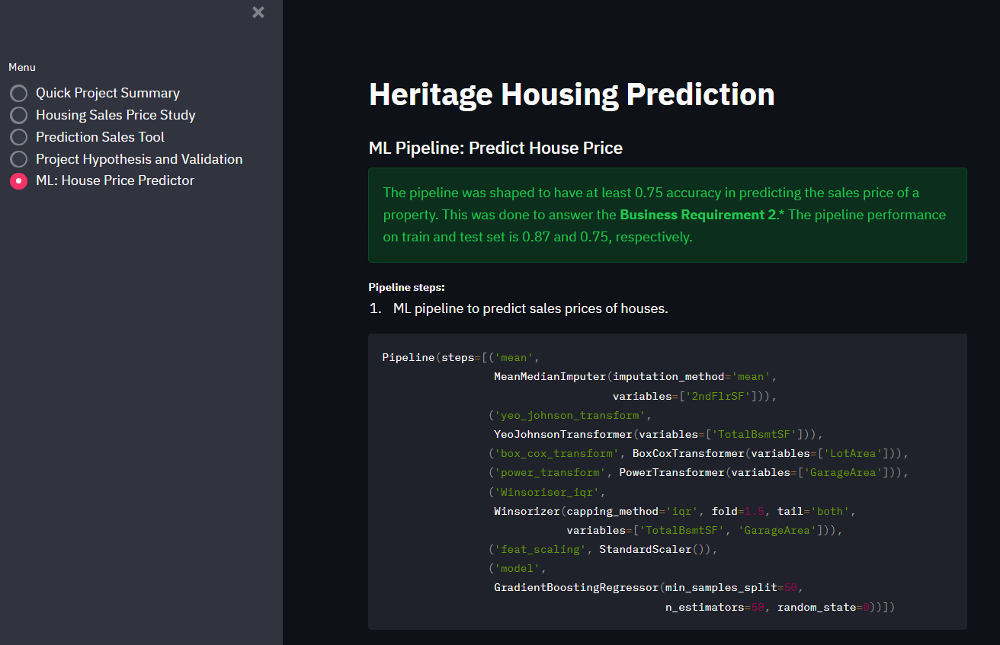
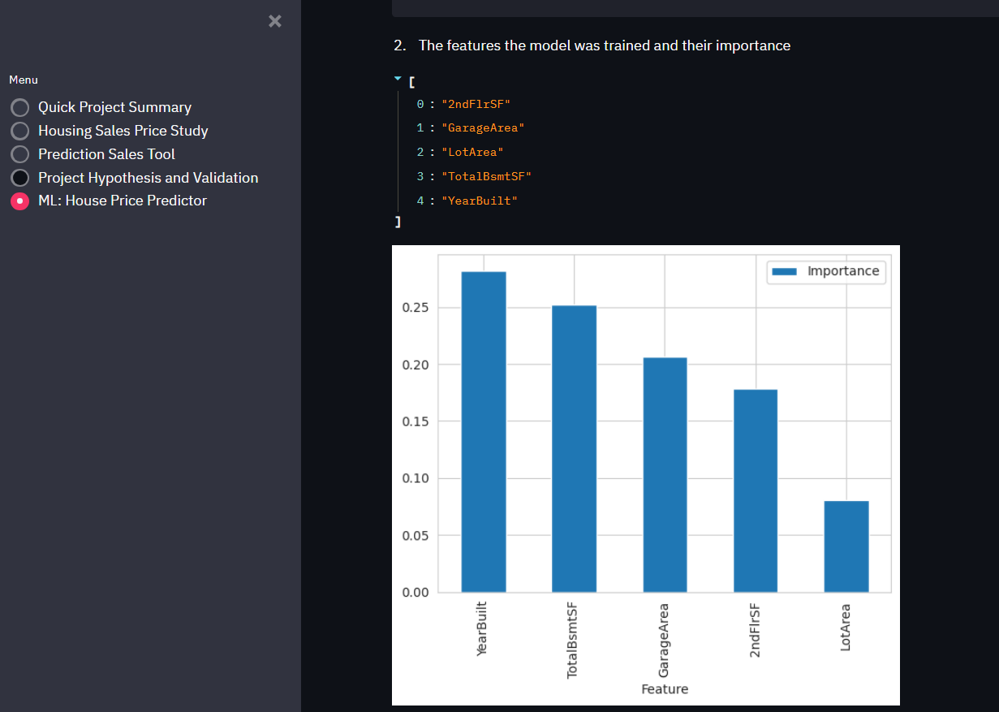
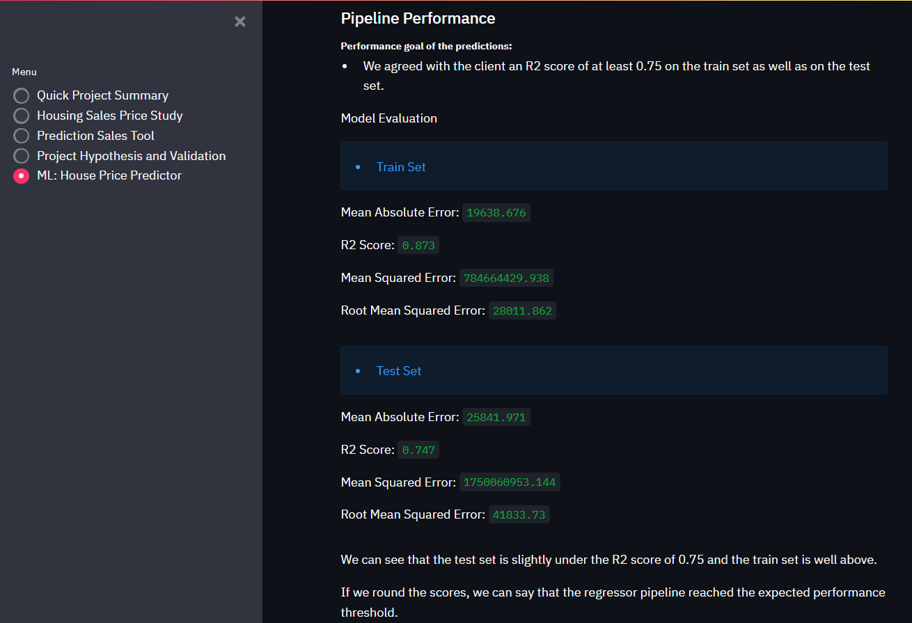
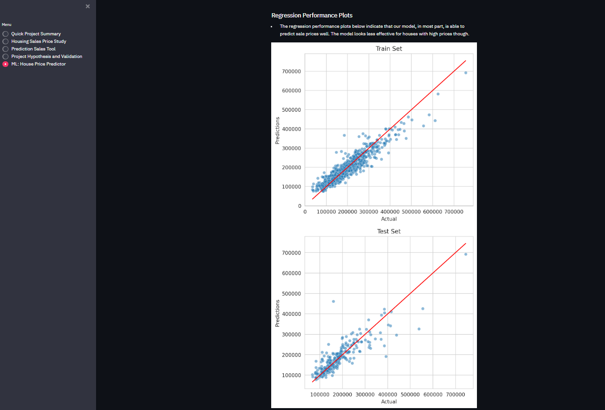

# Heritage Housing Prediction

The Heritage Housing Prediction tool is a Machine Learning project that helps the client to predict the sales prices of his inherited properties. It also helps any user to predict the price of any houses in Ames, Iowa.

Project URL: [Heritage Housing Prediction](https://heritage-housing-prediction-f1178ce60414.herokuapp.com/)

## Dataset Content

* The dataset is sourced from [Kaggle](https://www.kaggle.com/codeinstitute/housing-prices-data). We then created a fictitious user story where predictive analytics can be applied in a real project in the workplace. 
* The dataset has almost 1.5 thousand rows and represents housing records from Ames, Iowa, indicating house profile (Floor Area, Basement, Garage, Kitchen, Lot, Porch, Wood Deck, Year Built) and its respective sale price for houses built between 1872 and 2010.

|Variable|Meaning|Units|
|----|----|----|
|1stFlrSF|First Floor square feet|334 - 4692|
|2ndFlrSF|Second-floor square feet|0 - 2065|
|BedroomAbvGr|Bedrooms above grade (does NOT include basement bedrooms)|0 - 8|
|BsmtExposure|Refers to walkout or garden level walls|Gd: Good Exposure; Av: Average Exposure; Mn: Minimum Exposure; No: No Exposure; None: No Basement|
|BsmtFinType1|Rating of basement finished area|GLQ: Good Living Quarters; ALQ: Average Living Quarters; BLQ: Below Average Living Quarters; Rec: Average Rec Room; LwQ: Low Quality; Unf: Unfinshed; None: No Basement|
|BsmtFinSF1|Type 1 finished square feet|0 - 5644|
|BsmtUnfSF|Unfinished square feet of basement area|0 - 2336|
|TotalBsmtSF|Total square feet of basement area|0 - 6110|
|GarageArea|Size of garage in square feet|0 - 1418|
|GarageFinish|Interior finish of the garage|Fin: Finished; RFn: Rough Finished; Unf: Unfinished; None: No Garage|
|GarageYrBlt|Year garage was built|1900 - 2010|
|GrLivArea|Above grade (ground) living area square feet|334 - 5642|
|KitchenQual|Kitchen quality|Ex: Excellent; Gd: Good; TA: Typical/Average; Fa: Fair; Po: Poor|
|LotArea| Lot size in square feet|1300 - 215245|
|LotFrontage| Linear feet of street connected to property|21 - 313|
|MasVnrArea|Masonry veneer area in square feet|0 - 1600|
|EnclosedPorch|Enclosed porch area in square feet|0 - 286|
|OpenPorchSF|Open porch area in square feet|0 - 547|
|OverallCond|Rates the overall condition of the house|10: Very Excellent; 9: Excellent; 8: Very Good; 7: Good; 6: Above Average; 5: Average; 4: Below Average; 3: Fair; 2: Poor; 1: Very Poor|
|OverallQual|Rates the overall material and finish of the house|10: Very Excellent; 9: Excellent; 8: Very Good; 7: Good; 6: Above Average; 5: Average; 4: Below Average; 3: Fair; 2: Poor; 1: Very Poor|
|WoodDeckSF|Wood deck area in square feet|0 - 736|
|YearBuilt|Original construction date|1872 - 2010|
|YearRemodAdd|Remodel date (same as construction date if no remodelling or additions)|1950 - 2010|
|SalePrice|Sale Price|34900 - 755000|

## Business Requirements

We received a request from my friend, who has received an inheritance from a deceased great-grandfather located in Ames, Iowa, to  help in maximising the sales price for the inherited properties.
Although this friend has an excellent understanding of property prices in her own state and residential area, she fears that basing her estimates for property worth on her current knowledge might lead to inaccurate appraisals. What makes a house desirable and valuable where she comes from might not be the same in Ames, Iowa. She found a public dataset with house prices for Ames, Iowa, and will provide you with that.

We agreed on two business requirements: 

* BR1 - The client is interested in discovering how the house attributes correlate with the sale price. Therefore, the client expects data visualisations of the correlated variables against the sale price to show that.
* BR2 - The client is interested in predicting the house sale price from her four inherited houses and any other house in Ames, Iowa.

### CRISP-DM Workflow

You can refer to the project board to be able to track the tasks: [Heritage Housing Board](https://github.com/users/Shiimymy/projects/11/views/1).

## Hypothesis and how to validate?

1. Base on general knowledge, we suspect that the price of a house depend on the size of the house and the amount of work someone would need to live in it. So we are checking if features such as the size, the quality of the house and year it was built have an important positive impact on the sale price.
 * Validation: This hypothesis was confirmed during the correlation study in the SalesPriceStudy notebook for all 3 features: the size, the quality of the house and year it was built.

2. Given the dataset, we also suspect that the price of a house would correlate strongly with other different features which could be highlighted.
 * Validation : This hypothesis was confirmed during the correlation study in the SalesPriceStudy notebook and in the Assessment of the feature importancehere where we found out that the price of a house correlates strongly with other different features: ['GarageYrBlt'], ['GarageArea'] and ['YearRemodAdd']. We can see that the Garage and remodel date are important features in the area of Ames, Iowa.

3. We proposed that it is possible to predict a property's sale price with a reasonable model performance of a R2 score of at least 0.75 with the given dataset.
 * Validation:  This hypothesis was confirmed during the evalution of performance of the train and test set in the Modelling & Evaluation notebook. The score is 0.87 and 0.75, respectively. 

## The rationale to map the business requirements to the Data Visualisations and ML tasks

List of the business requirements:

### Business requierement 1: Data Exploration and Correlation Analysis.
* We will inspect the data related to the house report database.
* We will conduct a correlation and PPS study study (Pearson and Spearman) to understand better how the variables are correlated to SalePrice.
* We will visualize these variables against the SalePrice, so to summarize the insights.

### Business requierement 2: Regression analysis
* We will predict the Total SalePrice amount and set it as target for a Regression analysis.
* We will be able to predict the SalePrice for the 4 inherited houses, as well as any other house in Ames, Iowa.

## ML Business Case

* We want an ML model to predict the sale price for the 4 inherited houses, as well as any other house in Ames, Iowa.
* Our ideal outcome is for the client to maximize the sales price for the inherited properties thanks to a Dashboard.
* The model success metric are an R2 score of at least 0.75 on the train set as well as on the test set.
* The output is defined an estimated Total SalePrice amount that the client could sell any property with a breakdown on each proprety value. If the client plan to improve the house, the client will interview to gather the input data and feed it into the App. The prediction is made on the fly (not in batches).
* Heuristics:  Currently, there is no approach to predict the sale price.
* The training data to fit the model comes from the [Housing Prices Date](https://www.kaggle.com/datasets/codeinstitute/housing-prices-data). This dataset contains about 1460 house records.

## Dashboard Design

### Page 1: Project Summary

This page has a Quick project summary for a clear understanding of the project. It also include: 
* List of the Project Terms & Jargon,
* Description of the Project Dataset,
* Introduce the Business Requirements.

Quick Project Summary

### Page 2: Sales Price Study 

This page answers the Business Requirement 1. 

We can find: 
* a checkbox for inspecting the dataset,
* a listing the findings related to which features have the strongest correlation to the house sale price,
* a checkbox to display the distribution of the target variable `SalePrice`,
* a checkbox to display regression plots for numerical features and box plots for categorical features,
* a checkbox to display heatmaps showing correlations.

Housing Prices Study

**First Part:**

**Second Part:**

### Page 3: Predication Sales tool

This page answers the Business Requirement 2.
* Display the 4 houses' attributes and their respective predicted sale price. 
* Message informing the summed predicted price for all 4 inherited houses. 
* Interactive input widgets that allow a user to provide real-time house data to predict the sale price.

Predication Sales Tool Page

**First Part:**

**Second Part:**

### Page 4: Project Hypothesis and Validation

Page indicating project hypothesises and how they are validated across the project.

* **H1**: We expect that the size of a house, the quality of the house and year it was built are positively correlated to the sale price. This hypothesis was confirmed.
* **H2**: We expect that the price of a house would correlate strongly with other different features. This is confirmed as we found that  ['GarageYrBlt'], ['GarageArea'] and ['YearRemodAdd'] do correlate.
* **H3**: We expected to get a reasonable model performance of a R2 score of at least 0.75. This was confirmed as the pipeline performance on train and test set is 0.87 and 0.75, respectively.

Hypothesis Page

### Page 5: ML - Predict Sale Price

Technical page displaying the model performance. If an ML pipelineis deployed, display pipeline steps. We can see on this page:

* Pipeline steps
* Pipeline Performance :
 * Performance goal of the predictions
* Regression Performance Plots

ML Technical  Page

**First Part:**

**Second Part:**

**Third Part:**

**Fourth Part:**

## Unfixed Bugs

* There were no known unfixed bugs in this project.

## Deployment

### Heroku

The App live link is: https://heritage-housing-prediction-f1178ce60414.herokuapp.com/ 
* The project was deployed to Heroku using the following steps.
1. Log in to Heroku and create an App
2. Install heroku CLI in the IDE workplace terminal using the command: `curl https://cli-assets.heroku.com/install.sh | sh`
3. Log into Heroku CLI in IDE workspace terminal using the bash command: `heroku login -i` and enter user credentials.
4. Run the command: `heroku stack:set heroku-20 -a <your-app-name>`
5. At the Deploy tab, select GitHub as the deployment method.
6. Select your repository name and click Search. Once it is found, click Connect.
7. Select the branch you want to deploy, then click Deploy Branch.
8. The deployment process should happen smoothly if all deployment files are fully functional. Click the button Open App on the top of the page to access your App.

## Main Data Analysis and Machine Learning Libraries

List the libraries used in the project (check [requirements.txt](requirements.txt)):
* Jupyter: used for its interactive web application for creating the necessary notebooks to write the code for the ML project.
* Streamlit: used to create the dashboard to put their code into a web application.
* Numpy: is a Python library used for working with arrays, for example return an array of zeros with the same shape and type as a given array.
* Pandas: used for working with data sets, for example read a comma-separated values (csv) file into DataFrame.
* Matplotlib, Seaborn and Plotly: used for visualization of the data by generating different type of plots.
* Pandas Profiling: used to create a comprehensive Report of the dataset to help with Exploratory Data Analysis (EDA).
* ppscore: used to determine the predictive power score between two columns.
* feature-engine: used to engineer the dataset’s variables and select features for use in the machine learning model.
* datetime: used manipulating dates, used once in Streamlit app in the predict price Tool to set max year value.
* scikit-learn: is a Python library for machine learning used for example split randomly the train and test sets.

## Credits 

### Content 

* The base of the documentation was found in this [repository](https://github.com/Code-Institute-Solutions/milestone-project-heritage-housing-issues)
* I used this web page to help me [Interpreting Histograms](https://flexbooks.ck12.org/cbook/ck-12-probability-and-statistics-concepts/section/4.6/primary/lesson/interpreting-histograms-pst/).

### Code

* The the walk through project from [Code Institute](https://codeinstitute.net/ie/) help me with the development of this project.
* I used different web page, e.g.: 
 * [Streamlit](https://discuss.streamlit.io/t/imports-not-working-for-multipage-app/28274)
 * [feature-engine](https://feature-engine.trainindata.com/en/latest/user_guide/transformation/BoxCoxTransformer.html)

## Acknowledgements

* I would like to thank my mentor, Mo Shami, for his support and direction.